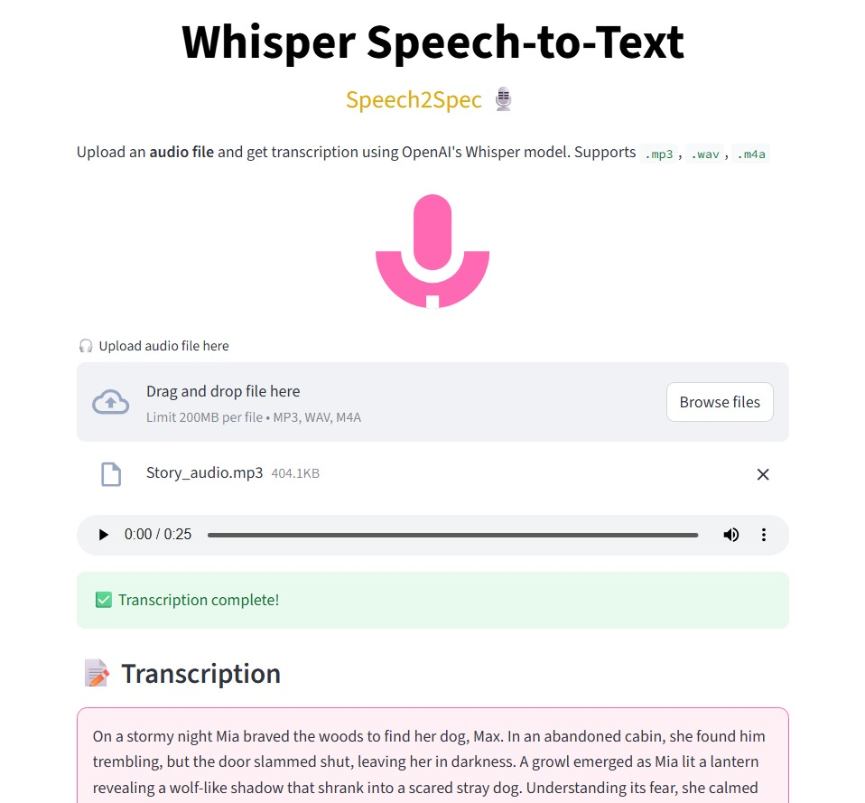

# 🎤 Whisper Speech-to-Text Web App


This is a lightweight web application built using **Streamlit** that leverages **OpenAI's Whisper model** for **speech-to-text transcription**. It automatically detects the language of the audio and supports transcription in multiple languages, including **English, Hindi, Marathi**, and more.

## 📸 Screenshot

---

## 🔍 Features

- 🎧 Upload audio files (`.mp3`, `.wav`, `.m4a`)
- 🌐 Automatic language detection
- 📝 Accurate transcription using Whisper (base model)
- 💡 Clean, colorful, responsive UI with SVG microphone icon
- ⚙️ Built using **Python**, **Streamlit**, and **Whisper by OpenAI**

---

## 🚀 Getting Started

### 1. Clone the repository

```bash
git clone https://github.com/yourusername/whisper-speech-to-text.git
cd whisper-speech-to-text
